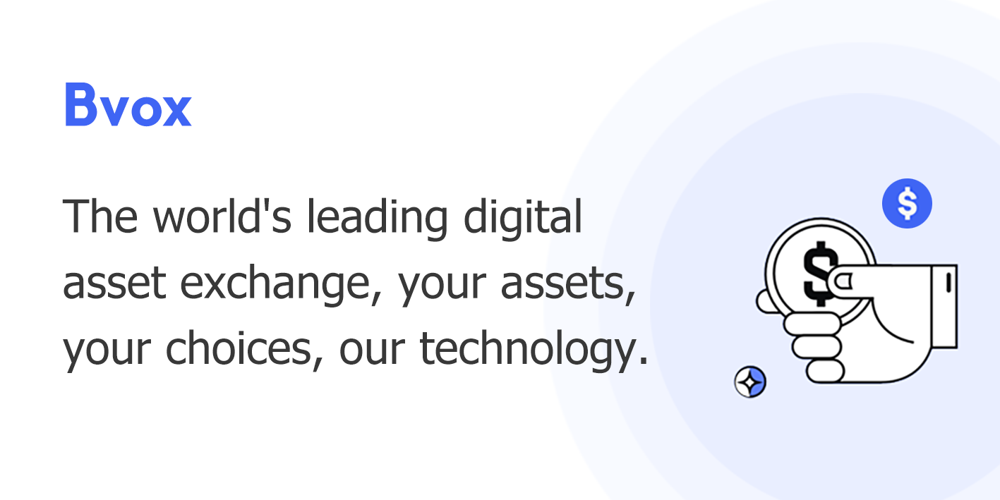

# BVOX Finance - Development Guide

## Project Structure Recommendation

The current structure with individual `_files` folders for each HTML file is not ideal. Here's the recommended organization:

### Current Structure (Not Recommended)
```
boxf version 2/
├── index.html
├── mining.html
├── contract.html
├── Bvox_files/
│   ├── style.css
│   └── [many other files]
├── mining_files/
│   └── style.css
└── ... (repeated for each page)
```

### Recommended Structure ✅
```
boxf version 2/
├── index.html                    # Main entry point
├── pages/                         # All HTML pages
│   ├── mining.html
│   ├── contract.html
│   ├── ai-arbitrage.html
│   ├── loan.html
│   ├── assets.html
│   └── ... other pages
├── css/                          # All stylesheets
│   ├── style.css                 # Main stylesheet
│   ├── layout.css                # Layout styles
│   └── responsive.css            # Mobile styles
├── js/                           # All JavaScript files
│   ├── config.js                 # ✨ NEW: Configuration
│   ├── utils.js                  # ✨ NEW: Utilities
│   ├── app.js                    # Main app logic
│   ├── jquery.js
│   ├── pako.min.js
│   └── ... other libraries
├── assets/                       # Static files
│   ├── images/
│   │   ├── banner4.png
│   │   ├── btc.png
│   │   ├── eth.png
│   │   └── ... other images
│   ├── icons/
│   │   ├── home-icon.png
│   │   ├── trade-icon.png
│   │   └── ... other icons
│   └── favicon.ico
├── server.js                     # ✨ NEW: Dev server
├── package.json                  # ✨ NEW: Node config
├── README.md                     # ✨ UPDATED: Setup guide
└── DEVELOPMENT.md                # ✨ NEW: This file
```

## Migration Steps

### Step 1: Consolidate CSS Files
Since all pages use similar styles, move all CSS to `css/style.css`:

```bash
# Copy main CSS
cp Bvox_files/style.css css/style.css
cp contract_files/layer.css css/layer.css

# Combine into one file if needed
# Edit css/style.css to include all necessary rules
```

### Step 2: Consolidate Images
```bash
# Create subdirectories
mkdir assets/images
mkdir assets/icons

# Move all PNG/JPG files
cp Bvox_files/*.png assets/images/
cp Bvox_files/*.ico assets/
```

### Step 3: Consolidate JavaScript
```bash
# Create js directory and move libraries
mkdir js
cp Bvox_files/jquery.js js/
cp Bvox_files/pako.min.js js/
cp Bvox_files/js.cookie.min.js js/
cp Bvox_files/web3.min.js js/
cp Bvox_files/web3provider.js js/
```

### Step 4: Move HTML Pages
```bash
# Create pages directory
mkdir pages

# Move pages (keep index.html in root)
cp mining.html pages/
cp contract.html pages/
cp ai-arbitrage.html pages/
# ... move all other pages
```

### Step 5: Update HTML References

**Before:**
```html
<link rel="stylesheet" href="./Bvox_files/style.css">
<script src="./Bvox_files/jquery.js"></script>

```

**After:**
```html
<link rel="stylesheet" href="../../css/style.css">
<script src="../../js/jquery.js"></script>

```

#### Quick Update Script

Use this PowerShell script to update all references:

```powershell
# Update CSS references
Get-ChildItem -Path "*.html" -Recurse | ForEach-Object {
    (Get-Content $_.FullName) -replace './Bvox_files/style.css', '../../css/style.css' | Set-Content $_.FullName
}

# Update JavaScript references
Get-ChildItem -Path "*.html" -Recurse | ForEach-Object {
    (Get-Content $_.FullName) -replace './Bvox_files/', '../../js/' | Set-Content $_.FullName
}

# Update image references
Get-ChildItem -Path "*.html" -Recurse | ForEach-Object {
    (Get-Content $_.FullName) -replace './Bvox_files/', '../../assets/images/' | Set-Content $_.FullName
}
```

## Configuration

### Update API URLs

Edit `js/config.js`:

```javascript
const API_CONFIG = {
    // Development
    baseURL: 'http://localhost:3000/api',
    
    // Production (uncomment for production)
    // baseURL: 'https://api.bvoxfinance.com/api',
};
```

### Environment Variables

Create `.env` file:

```env
NODE_ENV=development
API_URL=http://localhost:3000/api
WS_URL=wss://api.huobi.pro/ws
PORT=3000
```

Load in your backend (Node.js example):
```javascript
require('dotenv').config();
const apiUrl = process.env.API_URL;
```

## Running the Project

### Option 1: Node.js Server (Recommended)

```bash
# Install Node.js from nodejs.org if not already installed

# Navigate to project directory
cd "c:\Users\Black Coder\OneDrive\Desktop\crypto-nest\boxf version 2"

# Start server
node server.js

# Open http://localhost:3000 in browser
```

### Option 2: Python Server

```bash
# Python 3.x
python -m http.server 3000

# Python 2.x
python -m SimpleHTTPServer 3000
```

### Option 3: VS Code Live Server Extension

1. Install "Live Server" extension
2. Right-click `index.html`
3. Select "Open with Live Server"

## Development Workflow

### File Editing

1. **Edit HTML** - Modify files in `pages/` or `index.html`
2. **Edit CSS** - Modify `css/style.css`
3. **Edit JavaScript** - Add to `js/` folder or existing files
4. **Add Images** - Save to `assets/images/`

### Testing

- Open **Developer Tools** (F12)
- Check **Console** for errors
- Check **Network** tab for failed requests
- Test on mobile via Chrome DevTools or actual device

### Debugging

```javascript
// Console logging
console.log('Variable value:', variable);
console.table(arrayOrObject);
console.error('Error message');
console.warn('Warning message');

// Browser debugging
debugger; // Breakpoint in code
```

### Common Tasks

#### Add a new page

1. Create `pages/newpage.html`
2. Copy structure from existing page
3. Link it in navigation/menu
4. Update any page-specific CSS/JS

#### Add new market/cryptocurrency

1. Update `CRYPTOCURRENCIES` in `js/config.js`
2. Add icon to `assets/images/`
3. Update price subscription in `js/utils.js`
4. Update market display HTML

#### Create new component

```javascript
// In js/utils.js or separate file
class MyComponent {
    constructor(selector) {
        this.element = document.querySelector(selector);
    }
    
    init() {
        this.setupEventListeners();
        this.render();
    }
    
    setupEventListeners() {
        // Add event listeners
    }
    
    render() {
        // Render component
    }
}

// Usage
const component = new MyComponent('.my-component');
component.init();
```

## Performance Optimization

### Asset Optimization

- **Images**: Compress using TinyPNG or similar
- **CSS**: Minify for production
- **JavaScript**: Minify and bundle for production

### Caching Strategy

```javascript
// In server.js, appropriate cache headers are already set
// Static assets: 1 hour cache
// HTML files: No cache (always fetch fresh)
```

### Lazy Loading

```html
<!-- Lazy load images -->

```

## Deployment Checklist

- [ ] Update API URLs to production
- [ ] Minify CSS and JavaScript
- [ ] Optimize all images
- [ ] Test all links
- [ ] Test on multiple browsers
- [ ] Test on mobile devices
- [ ] Check for console errors
- [ ] Enable HTTPS
- [ ] Set up SSL certificate
- [ ] Configure CORS properly
- [ ] Set up monitoring/logging
- [ ] Update README with production URLs

## Troubleshooting

### Port Already in Use
```powershell
# Find process using port 3000
netstat -ano | findstr :3000

# Kill the process (replace PID)
taskkill /PID <PID> /F

# Or use different port
$env:PORT=3001; node server.js
```

### CSS Not Loading
- Check file path in HTML
- Check browser cache (Ctrl+Shift+Delete)
- Verify CSS syntax in browser DevTools

### JavaScript Errors
- Check console (F12)
- Verify script paths
- Check for typos in function names
- Verify libraries are loaded before use

### API Connection Issues
- Check if backend is running
- Verify API URL in config.js
- Check CORS headers
- Monitor Network tab in DevTools

## Resources

- [MDN Web Docs](https://developer.mozilla.org/)
- [jQuery Documentation](https://jquery.com/)
- [Web3.js Documentation](https://web3js.readthedocs.io/)
- [Huobi API Documentation](https://huobiapi.github.io/docs/)
- [JavaScript Best Practices](https://developer.mozilla.org/en-US/docs/Web/JavaScript/Guide)

## Best Practices

1. **Always test locally** before deployment
2. **Use version control** (Git)
3. **Keep dependencies updated**
4. **Write comments** for complex logic
5. **Use meaningful variable names**
6. **Minimize global variables**
7. **Handle errors gracefully**
8. **Test on multiple devices**
9. **Monitor performance**
10. **Keep security in mind**

## Questions?

Refer to the main README.md for more information or contact the development team.
